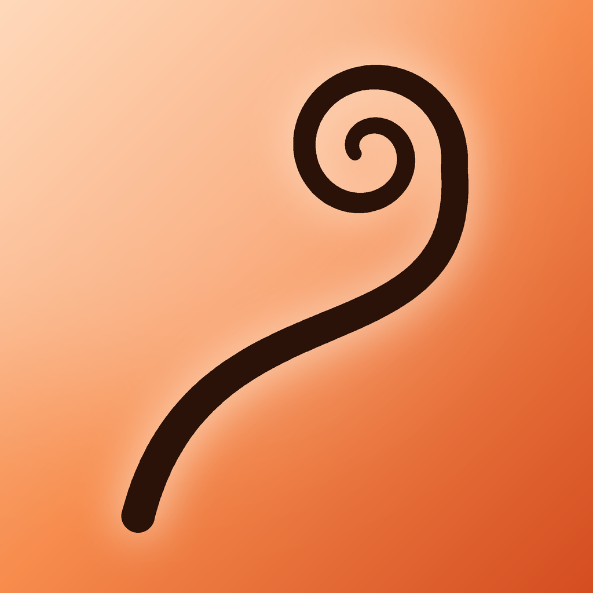

# Zarcillo

<p align="center"></p>

tu iPhone como control remoto del Mac. el zarcillo es la parte de la planta que se estira y se agarra a otra: eso hace el teléfono con la computadora.

## qué hace

- **apps**: las apps de tu Dock con sus iconos reales; un toque la abre o la trae al frente.
- **dial**: volumen y brillo en una regla circular, con un golpe háptico en cada marca. el Mac muestra el mismo dial flotando bajo la barra de menús.
- **gestos**: desliza para cambiar de escritorio, arriba para Mission Control, abajo para las ventanas de la app, doble toque para Spotlight.
- **pad**: trackpad con clic, doble clic, clic derecho con dos dedos, desplazamiento con dos dedos y arrastre manteniendo el dedo. debajo, controles de música y atajos de teclado que armas tú.

## cómo se conectan

todo va por tu Wi-Fi, sin servidores ni cuentas. el Mac se anuncia con Bonjour (`_zarcillo._tcp`) y el iPhone lo encuentra solo.

la primera vez, el iPhone pide el código de 6 dígitos que muestra el Mac en la barra de menús. la conexión es TLS 1.2 con clave precompartida derivada de ese código: sin él no se completa el saludo, y todo lo que viaja va cifrado. el código se guarda en el llavero del iPhone. generar uno nuevo en el Mac desconecta a todos.

## permisos en el Mac

mover el cursor, hacer clic y usar atajos necesita **Accesibilidad** (Ajustes del Sistema › Privacidad y seguridad › Accesibilidad › Zarcillo). sin ese permiso funcionan igual las apps, el volumen y el brillo.

el brillo usa `DisplayServices`, un framework privado de macOS: funciona con la pantalla integrada y se desactiva solo si Apple lo quita.

## compilar

```bash
brew install xcodegen
xcodegen generate
open Zarcillo.xcodeproj
```

- **ZarcilloMac**: app de barra de menús. cópiala a `/Applications` para que "abrir al iniciar sesión" funcione.
- **Zarcillo**: app del iPhone. pon tu equipo en `DEVELOPMENT_TEAM`.

con cuenta gratuita de Apple hay un límite de 10 App IDs nuevos por semana; por eso `project.yml` reutiliza uno ya registrado. cámbialo por `com.kisnner.zarcillo` cuando quieras.

## estructura

```
Shared/   protocolo (órdenes y eventos) y canal TLS con mensajes enmarcados
Mac/      servidor, acciones del sistema (CoreAudio, CGEvent, DisplayServices), HUD y menú
iOS/      conexión, páginas (apps, dial, gestos, pad) y editor de atajos
```

## licencia

MIT
