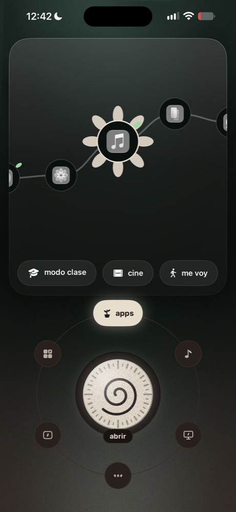
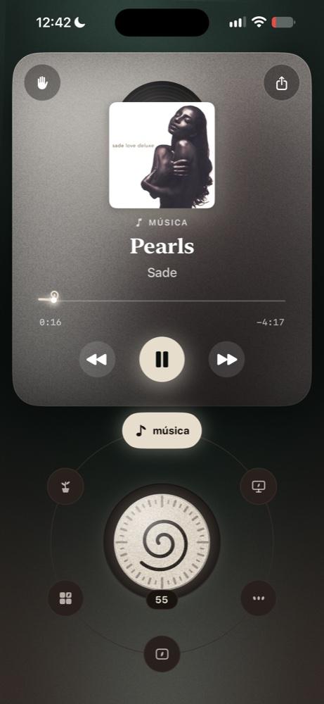
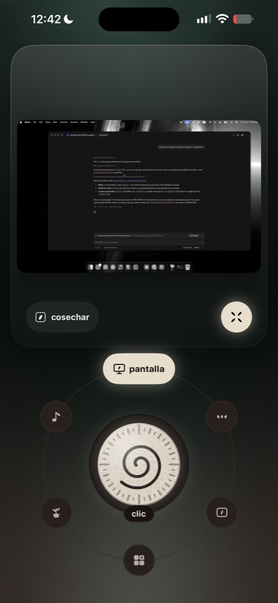
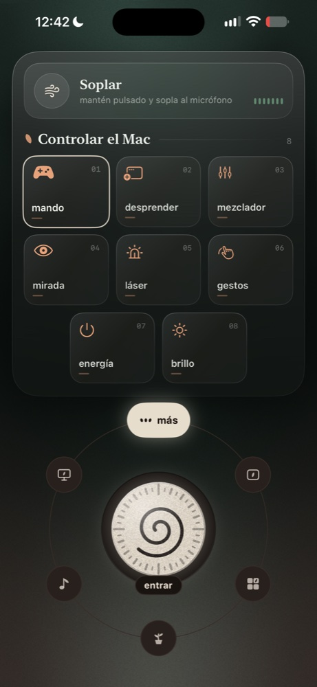
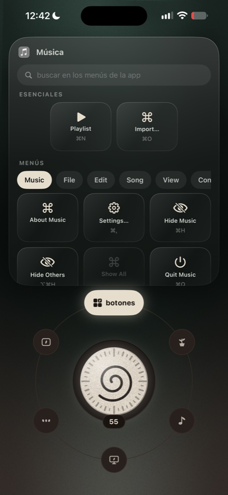

# Zarcillo

<p align="center"></p>

tu iPhone como control remoto del Mac. el zarcillo es la parte de la planta que se estira y se agarra a otra: eso hace el teléfono con la computadora.

<p align="center">
  
  
  
  
  
</p>

## qué hace

- **apps**: las apps de tu Dock con sus iconos reales; un toque la abre. mantenla pulsada para ver sus ventanas y saltar a una en concreto. arriba, tus **escenas**.
- **pad**: trackpad con clic, doble clic, clic derecho con dos dedos, desplazamiento con inercia y arrastre. **teclado remoto** (lo que escribes o dictas aparece en el Mac mientras escribes), **portapapeles** en los dos sentidos (texto e imágenes) y atajos de teclado que armas tú.
- **música**: lo que suena en Música o Spotify, con carátula, barra para adelantar y volumen.
- **pantalla**: el Mac en vivo en el iPhone; tocas la imagen y el clic cae ahí. mantener = clic derecho.
- **más**:
  - **dial** de volumen y brillo con háptico en cada marca; el Mac muestra el mismo dial flotando.
  - **gestos**: escritorios, Mission Control, ventanas de la app y Spotlight.
  - **láser**: apuntas girando el iPhone y el Mac dibuja un punto de luz; flechas para pasar diapositivas.
  - **energía**: bloquear, apagar la pantalla, suspender y despertar.
  - **escenas**: varias acciones de un toque (abrir apps o páginas, volumen, brillo, música, teclas, gestos, atajos de la app Atajos, esperas).
- **Siri, Atajos y botón de Acción**: pausar la música, siguiente canción, bloquear o suspender el Mac, cambiar el volumen y ejecutar una escena, sin abrir la app.

## cómo se conectan

todo va por tu Wi-Fi, sin servidores ni cuentas. el Mac se anuncia con Bonjour (`_zarcillo._tcp`) y el iPhone lo encuentra solo.

la primera vez, el iPhone pide el código de 6 dígitos que muestra el Mac en la barra de menús. la conexión es TLS 1.2 con clave precompartida derivada de ese código: sin él no se completa el saludo, y todo lo que viaja va cifrado. el código se guarda en el llavero del iPhone. generar uno nuevo en el Mac desconecta a todos.

## permisos en el Mac

- **Accesibilidad**: mover el cursor, hacer clic, escribir, atajos y ventanas. sin él funcionan igual las apps, el volumen y el brillo.
- **Grabación de pantalla**: solo para la pestaña pantalla.
- **Automatización** (Música, Spotify): macOS lo pregunta la primera vez que Zarcillo lee qué suena.

todo se da en Ajustes del Sistema › Privacidad y seguridad. el menú de la hoja avisa cuál falta.

**despertar**: macOS ya no deja que una app lea la dirección física del Mac, así que no hay Wake-on-LAN. el iPhone vuelve a buscar el servicio Bonjour y, si en casa hay un HomePod o un Apple TV, ellos despiertan al Mac (hace falta "Activar con acceso a la red").

**widgets**: pendientes. necesitan un App ID nuevo y la cuenta gratuita de Apple ya usó los 10 de esta semana.

el brillo usa `DisplayServices`, un framework privado de macOS: funciona con la pantalla integrada y se desactiva solo si Apple lo quita.

## compilar

```bash
brew install xcodegen
xcodegen generate
open Zarcillo.xcodeproj
```

- **ZarcilloMac**: app de barra de menús. cópiala a `/Applications` para que "abrir al iniciar sesión" funcione.
- **Zarcillo**: app del iPhone. pon tu equipo en `DEVELOPMENT_TEAM`.

con cuenta gratuita de Apple hay un límite de 10 App IDs nuevos por semana; por eso `project.yml` reutiliza uno ya registrado. cámbialo por `com.kisnner.zarcillo` cuando quieras.

## estructura

```
Shared/   protocolo (órdenes y eventos) y canal TLS con mensajes enmarcados
Mac/      servidor, acciones del sistema (CoreAudio, CGEvent, DisplayServices), HUD y menú
iOS/      conexión, páginas (apps, dial, gestos, pad) y editor de atajos
```

## licencia

MIT
